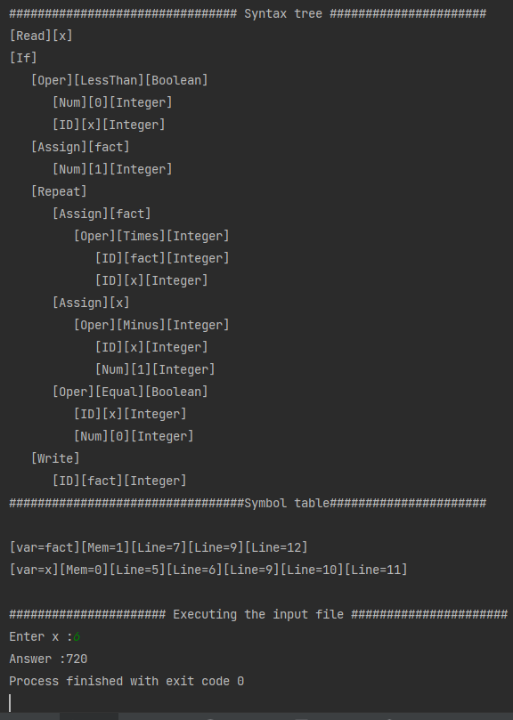

# Tiny-language-compiler 
  A compiler for TINY language in C++ that include scanner, parser, analyzer and code generator , which mimics what happens in an actual compiler 

# Tiny-langaue-rules:
    .sequence of statements separated by ;
    .Comments {}
    .I/O read write
    .math expressions integers only, + - * / ^
    .boolean only in if and repeat conditions < = and two mathematical expressions
    .repeat-statement: repeat until (boolean)
    .if-statement: if (boolean) then [else] end
    .variable names can include only alphabetic characters(a:z or A:Z) and underscores
    .variables are declared simply by assigning values to them :=
    .all variables are integers
    .no procedures - no declarations   

# Test case 1 :
  read x; {input an integer}
  if 0<x then {compute only if x>=1}
    fact:=1;
    repeat
      fact := fact * x;
      x:=x-1
    until x=0;
    write fact {output factorial}
  end

# Output test case 1 : 

